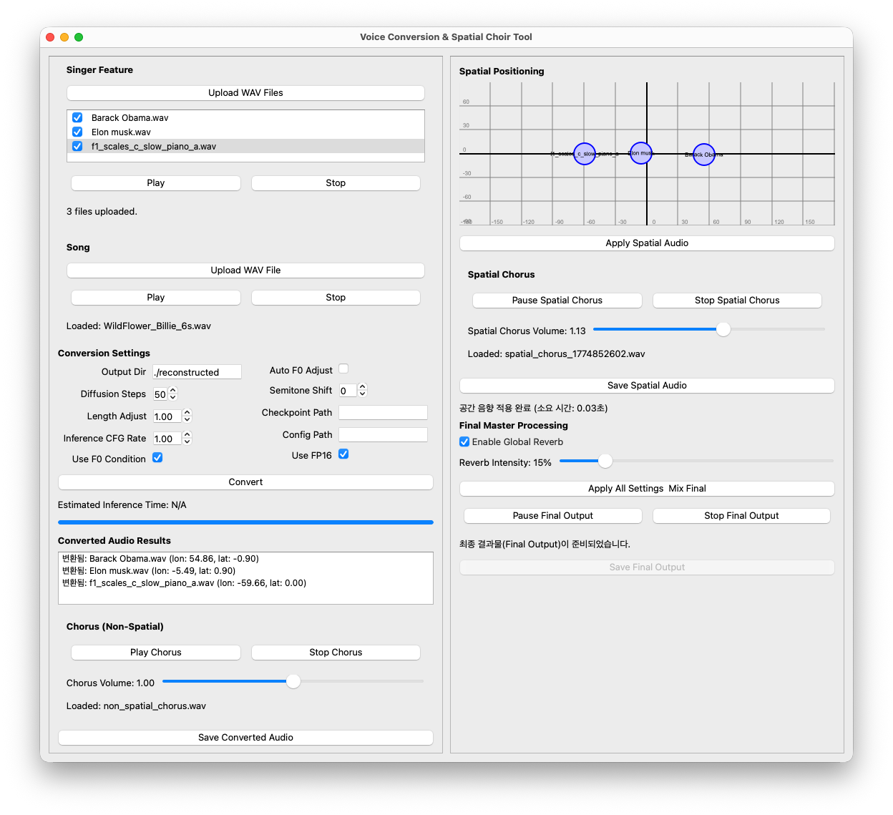

This program has only been tested on Apple Silicon Mac, and it is highly likely that it will not function properly in other environments.

follow the step

# 1. Download repository files

# 2. Set environment
```bash
# create virtual environment
python3 -m venv myvenv
source myvenv/bin/activate
pip3 install -r requirements.txt #This may take a few minutes
```

# 3. Excute the Program
```bash
python3 audience-choir.py #This may take a minute
```


# 4. Upload Singer and Song Audio file
You can use any .wav format audio file for singer(program extract vocal feature from given audio speech or sing) and Song(program extract note and style from uploaded song file)

# 5. Convert and Play
When running this program for the first time, it may take some time as the voice conversion model needs to be loaded.

For the first conversion, try running the program with the "song/SeeYouAgain_Charlie_4s.wav". This is because the longer the audio file, the more time the conversion process will take.
